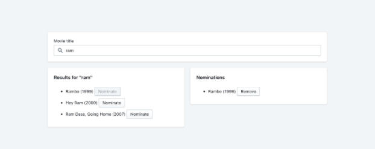

## The Challenge

Create a webpage that can search OMDB for movies, and allow the user to save their favourite films they feel should be up for nomination. When they've selected 5 nominees they should be notified they're finished.

### Requirements 
* Simple to use interface.
* The ability search the OMDB API and return a list of movies that show at least the title, release year and a button to nominate them. 
* Search results should only be of movies.
* Updates to the search terms should update the result list.
* If a movie has been nominated already, it's button should be disabled within the search results. 
* Nominated movies should move to their own "Nomination List".
* Movies in the nomination list should be able to be removed.
* Display a banner when the user has 5 nominations.

### References

#### Reference image

#### OMDB API
[https://www.omdbapi.com/](https://www.omdbapi.com/)

### Extras
Improvements to design and functionality are allowed to be added in order to highlight passion and skills.

## Submission Requirements

1. Zip your submission, rename the zip file into your name `first-last.zip` and send it to <a href="mailto:albert@contactout.io">albert@contactout.io</a> and <a href="mailto:ac@contactout.io">ac@contactout.io</a>. You may need to upload it to google drive if you're not able to share a zip file in the email directly.
2. Please also create a video demo walking us through the submission and a separate one to explain the code. Make sure to include the video links in your readme

Vidyard or loom are free tools that allow you to screen record easily.

